# Architecture Overview — Opslin

A **safe, high-level** description of how Opslin is structured. This document deliberately avoids internal implementation details, exact protocols, credentials, command-execution specifics, and anything that could help misuse the platform. It is intended for investors, startup programs, partners, advisors, and technically curious readers.

> **Design principle:** Opslin uses a lightweight agent installed on the user's VPS. The agent connects securely to the Opslin control plane and enables dashboard-driven deployment, monitoring, logs, and infrastructure workflows.

---

## 🧱 High-level components

| Component | Role |
|---|---|
| **User** | Operates everything through a web dashboard |
| **Opslin Dashboard** | Web interface for deployment, monitoring, logs, and infrastructure workflows |
| **Opslin Control Plane (API)** | Coordinates requests, manages state, and communicates securely with agents |
| **Lightweight VPS Agent** | A small program installed on the user's server that executes dashboard-driven actions locally |
| **User-Owned VPS** | The server the user owns and controls; Opslin operates on top of it |
| **Application Containers** | The user's deployed applications running on their VPS |
| **Databases** | Data stores provisioned and managed for the user's applications |
| **Monitoring / Logs** | Health metrics and log streams surfaced back to the dashboard |

---

## 🗺️ System diagram (high-level)

```mermaid
flowchart TD
    User([User])
    Dashboard[Opslin Dashboard]
    ControlPlane[Opslin Control Plane / API]
    Agent[Lightweight VPS Agent]

    subgraph VPS[User-Owned VPS]
        Apps[Application Containers]
        DBs[Databases]
        Mon[Monitoring / Logs]
    end

    User --> Dashboard
    Dashboard <--> ControlPlane
    ControlPlane <--> Agent
    Agent --> Apps
    Agent --> DBs
    Agent --> Mon
    Mon --> Agent
    Agent --> ControlPlane
    ControlPlane --> Dashboard
```



*The diagram is intentionally high-level. It shows the relationships between components, not internal protocols or implementation detail.*

---

## 🧭 Layer responsibilities

### 1. Control plane / Dashboard
The dashboard is where the user does everything: connect a server, deploy apps, manage databases, configure domains and SSL, and view monitoring and logs. It presents a clear, modern interface over infrastructure that would otherwise require manual server work.

### 2. Backend / API layer
The control plane API coordinates requests from the dashboard, keeps track of servers, applications, databases, and their states, and communicates securely with the agents running on user VPSs. It acts as the trusted coordination point between the user's actions and their servers.

### 3. Lightweight VPS agent
A small program the user installs on their own server. It connects securely to the control plane and carries out dashboard-driven actions locally on the VPS. The agent is what allows Opslin to operate a server the user owns **without the user having to perform the steps manually.**

### 4. User-owned VPS
The server remains owned and controlled by the user. Applications, databases, and monitoring all run on this server. Opslin operates **on top of** infrastructure the user already controls.

---

## 🔄 Key workflows (high-level)

### Deployment workflow
```text
User initiates a deploy from the dashboard
  → Control plane records the request and coordinates the work
  → Agent performs the deployment on the user's VPS
  → Application runs in a container on the VPS
  → Status and logs are surfaced back to the dashboard
```

### Monitoring & logging workflow
```text
Agent observes server health and application status on the VPS
  → Metrics and logs are relayed to the control plane
  → Dashboard displays health, resource usage, and logs to the user
```

### Database workflow
```text
User requests a database from the dashboard
  → Control plane coordinates the request
  → Agent provisions and manages the database on the user's VPS
  → Connection and status details are surfaced in the dashboard
```

### SSL / domain workflow
```text
User configures a domain and enables SSL from the dashboard
  → Control plane coordinates the configuration
  → Agent applies the necessary setup on the VPS
  → The application becomes reachable over the configured domain with SSL
```

### Firewall workflow (preview-before-apply)
```text
User reviews a proposed firewall policy in the dashboard
  → Control plane coordinates a preview of the change
  → User approves
  → Agent applies the policy on the VPS, with the ability to revert
```

### CI deploy-gate workflow (optional)
```text
A code change triggers checks via the connected source repository
  → Results are reported back to the control plane
  → A deploy proceeds only if the configured gate conditions are satisfied
```

*These descriptions are intentionally high-level and omit exact commands, sequencing, and internal mechanisms. The firewall flow follows a deliberate preview-before-apply pattern with revert, reflecting the security-conscious design.*

### Capability scope (current build)

The current product build includes a broad set of application and data types on the user's VPS, present and undergoing beta validation:

- **Applications:** Node.js (with framework detection), Python, Go, PHP, Ruby, Java, Rust, and static sites
- **Databases:** PostgreSQL, MySQL, MongoDB, Redis
- **Operational layers:** monitoring/health checks, logs, reverse-proxy (nginx) configuration, firewall management, alerts, and scheduled backups
- **Collaboration:** organizations with role-based access

*This reflects what is present in the current product build and is undergoing validation through the pre-launch beta.*

---

## 🔐 Security boundaries (security-conscious design)

Opslin is built with a **security-conscious** posture. At a high level:

- **The user owns and controls their VPS.** Opslin operates on top of infrastructure the user already controls.
- **The agent connects securely to the control plane.** Communication between the agent and the control plane is designed to be authenticated and secure.
- **Clear separation of layers.** The dashboard, control plane, and agent have distinct responsibilities, creating clear boundaries between user actions, coordination, and on-server execution.
- **Secrets are handled with care.** Sensitive values are protected rather than exposed in the interface or logs.
- **Beta hardening is ongoing.** Security validation is an explicit part of the pre-launch beta (see [BETA_TESTING_PLAN.md](BETA_TESTING_PLAN.md)).

> This document does **not** describe authentication formats, signing methods, privileged execution paths, internal routes, or any operational detail that could aid misuse. Opslin does not claim to be "fully enterprise-grade" or "unhackable"; it follows a security-conscious design and continues to harden through beta. A dedicated, public-safe summary is in [SECURITY_OVERVIEW.md](SECURITY_OVERVIEW.md).

---

## 🧩 Why this architecture

- **Bring your own VPS:** the user keeps cost advantages and full control of their server.
- **Lightweight agent:** minimal footprint on the user's machine while enabling rich dashboard-driven workflows.
- **Centralized control plane:** a single, consistent place to operate one or many servers.
- **Clear separation of concerns:** dashboard (interface), control plane (coordination), agent (on-server execution).

---

*This is a high-level architecture overview for a public audience. Implementation specifics are intentionally omitted to keep the platform and its users safe.*
